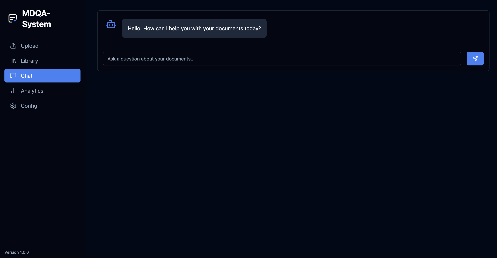

# MDQA-System: Your Personal Document Intelligence Engine


⚠️ This project is under active development and is **not production-ready**.

MDQA-System is a powerful, **private**, and intelligent platform that transforms your personal or professional documents into a searchable knowledge base. Upload your PDFs, DOCX files, and text documents, and ask complex questions in natural language to get synthesized, accurate answers based solely on the provided content.

This project is built with a modern, robust stack featuring a FastAPI backend and a React frontend. It leverages a sophisticated, local-first RAG (Retrieval-Augmented Generation) pipeline, ensuring your data remains completely private and secure on your own machine.

 


---

## Table of Contents
- [Features](#features)
- [How It Works: The RAG Pipeline](#how-it-works-the-rag-pipeline)
- [Tech Stack](#tech-stack)
- [Getting Started](#getting-started)
  - [Prerequisites](#prerequisites)
  - [Setup Instructions](#setup-instructions)
- [Tuning for Performance & Quality](#tuning-for-performance--quality)
- [Project Roadmap: Future Improvements](#project-roadmap-future-improvements)
- [Contributing](#contributing)

---

## Features

*   **Universal Document Support:** Ingest knowledge from `.pdf` (including scanned documents via OCR), `.docx`, `.txt`, and `.md`.
*   **100% Private and Offline:** All data processing and AI inference happens locally. Your documents are never sent to any third-party service.
*   **State-of-the-Art RAG Pipeline:**
    *   **Robust Chunking:** Uses a recursive character splitter to safely and effectively chunk any document, regardless of formatting.
    *   **Top-Tier Embedding:** Employs the powerful `BAAI/bge-m3` model to create nuanced, high-quality vector representations of your text.
    *   **Advanced Hybrid Search:** Combines keyword search (BM25) and semantic search, then re-ranks results using Reciprocal Rank Fusion (RRF) for maximum relevance.
    *   **High-Quality Generative Answers:** Powered by the **Meta-Llama-3-8B-Instruct** model, providing synthesized, coherent answers instead of just extracting text.
*   **Universal Hardware Support:** The AI model is loaded via `ctransformers` (llama.cpp), which automatically detects and utilizes the best available hardware (NVIDIA CUDA, Apple Metal GPU, or CPU) on any platform (Windows, macOS, Linux).
*   **Intuitive User Interface:**
    *   A clean, modern, dark-themed UI built with React and Tailwind CSS.
    *   **Document Library:** Manage, view, and delete your uploaded documents.
    *   **Chunk Inspector:** Verify document processing by viewing the individual text chunks created for RAG.
    *   **Conversational Chat:** Interact with your knowledge base through a familiar chat interface.
*   **System Analytics:** A dashboard to monitor system usage and performance.

## How It Works: The RAG Pipeline

1.  **Ingest:** A document is parsed, and text is extracted (with OCR as a fallback).
2.  **Chunk:** The text is divided into small, overlapping, and highly focused chunks.
3.  **Embed:** Each chunk is converted into a vector using the `bge-m3` model.
4.  **Index:** The chunks and their vectors are stored in a local ChromaDB database.
5.  **Retrieve:** When you ask a question, the system performs a hybrid search to find the most relevant chunks.
6.  **Synthesize:** The question and the retrieved chunks are formatted into a specific prompt and sent to the **Llama 3** model, which generates a brand new, accurate answer.

## Tech Stack

| Component | Technology |
| :--- | :--- |
| **Backend** | Python, FastAPI, SQLModel |
| **Frontend** | React, TypeScript, Vite, Tailwind CSS |
| **Vector Database** | ChromaDB (Embedded) |
| **Metadata Database**| SQLite |
| **Embedding Model** | `BAAI/bge-m3` |
| **Generation Model** | `Meta-Llama-3-8B-Instruct` (via `ctransformers`) |
| **Orchestration** | Docker, Docker Compose (Optional) |

## Getting Started

### Prerequisites
*   [Python 3.11+](https://www.python.org/downloads/)
*   [Node.js](https://nodejs.org/) (LTS version)
*   A C++ compiler (required for `ctransformers` installation).
    *   **macOS:** Install Xcode Command Line Tools: `xcode-select --install`
    *   **Ubuntu:** `sudo apt-get install build-essential`
    *   **Windows:** Install Visual Studio with the "Desktop development with C++" workload.

### Setup Instructions

This guide is for running the system locally without Docker.

1.  **Clone the repository and navigate into the `backend` directory.**
2.  **Create and activate a Python virtual environment:**
    ```bash
    python -m venv .venv
    source .venv/bin/activate  # On Windows: .venv\Scripts\activate
    ```
3.  **Install backend dependencies:**
    This may take several minutes, especially `ctransformers`.
    ```bash
    pip install -r requirements.txt
    ```
    *   **For Apple Silicon Macs:** To enable GPU acceleration, you must reinstall `ctransformers` with the Metal flag:
        ```bash
        pip uninstall ctransformers --yes
        CT_METAL=1 pip install ctransformers --no-binary ctransformers
        ```
4.  **Set up your Hugging Face token:**
    *   Create a `.env` file in the `backend` directory: `cp .env.local .env`
    *   Edit `backend/.env` and add your Hugging Face token. This is required to download the Llama 3 tokenizer.
        ```dotenv
        HF_TOKEN=hf_YourHuggingFaceTokenGoesHere
        ```
5.  **Start the backend server (in your first terminal):**
    ```bash
    uvicorn app.main:app --reload --port 8000
    ```
    The first time you ask a question, the system will download the Llama 3 model (~5.5 GB). This is a one-time process.

6.  **Setup and run the frontend (in a new, separate terminal):**
    ```bash
    cd ../frontend
    npm install
    npm run dev
    ```
7.  **Access the application** in your browser at `http://localhost:5173`.

---

## Tuning for Performance & Quality

The quality of a RAG system depends on several key parameters. The current settings provide a strong baseline, but they can be tuned for specific use cases.

*   **For Demo Purposes:** The current settings (`chunk_size=256`, `Llama-3-8B`) are optimized for a balance of quality and performance on consumer hardware.
*   **For Higher Quality:** If you have a powerful machine (e.g., a high-end NVIDIA GPU), you can achieve even better results.

Key files for tuning:
*   `backend/app/core/settings.py`: For chunk size and overlap.
*   `backend/app/rag/retrieve.py`: For the embedding model.
*   `backend/app/rag/answer.py`: For the generation model.

## Project Roadmap: Future Improvements

This project is a powerful foundation. Here are some potential next steps:

*   **Pluggable Models:**
    *   **Generation:** Abstract the `answer.py` logic to easily switch between different GGUF models (e.g., `Mistral`, `Qwen`) or even different model loaders (like `transformers` or an Ollama client).
    *   **Embedding:** Allow the embedding model to be configured via the `.env` file.
*   **Advanced RAG Techniques:**
    *   **Cross-Encoder Re-ranking:** Add a second-stage re-ranker after the initial retrieval to further improve the relevance of the context sent to the LLM.
    *   **Query Transformations:** Implement techniques like HyDE (Hypothetical Document Embeddings) to improve retrieval for complex questions.
*   **Production & UX:**
    *   **User Authentication:** Add a login system for multi-user support.
    *   **Streaming Responses:** Modify the API to stream the LLM's response token by token for a more interactive feel.
    *   **Conversation History:** Save and load past chat sessions.

## Contributing

Contributions are welcome! Please feel free to fork the repository, make your changes, and submit a pull request.

## Status
This project is still in its early stages. Expect breaking changes.