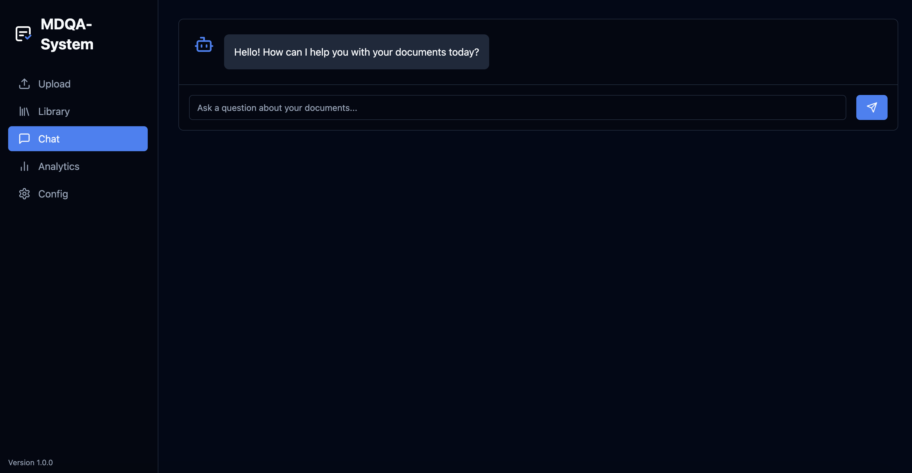

# MDQA-System: Your Personal Document Intelligence Engine


> ⚠️ This project is under active development and is **not production-ready**.

MDQA-System is a powerful, **private**, and intelligent platform that transforms your personal or professional documents into a searchable knowledge base. Upload your PDFs, DOCX files, and text documents, and ask complex questions in natural language to get synthesized, accurate answers based solely on the provided content.

This project is built with a modern stack featuring a FastAPI backend and a React frontend. It leverages a sophisticated, **100% offline** RAG (Retrieval-Augmented Generation) pipeline — your data never leaves your machine.

 

---

## Table of Contents
- [Features](#features)
- [System Requirements](#system-requirements)
- [How It Works: The RAG Pipeline](#how-it-works-the-rag-pipeline)
- [Tech Stack](#tech-stack)
- [Getting Started](#getting-started)
- [Voice Pipeline (STT + TTS)](#voice-pipeline-stt--tts)
- [Configuration](#configuration)
- [Tuning for Performance & Quality](#tuning-for-performance--quality)
- [Project Roadmap](#project-roadmap)
- [Contributing](#contributing)

---

## Features

*   **Universal Document Support:** Ingest knowledge from `.pdf` (including scanned documents via OCR), `.docx`, `.txt`, `.html`, and `.md`.
*   **100% Private and Offline:** All data processing and AI inference happens locally. Your documents are never sent to any third-party service.
*   **Optimized for Consumer Hardware:** Designed to run comfortably on systems with **16GB RAM**, with ~6GB headroom to spare.
*   **State-of-the-Art RAG Pipeline:**
    *   **Robust Chunking:** Uses a recursive character splitter to safely and effectively chunk any document.
    *   **Lightweight Embedding:** Uses `all-MiniLM-L6-v2` (~80MB) for fast, high-quality vector representations.
    *   **Query Transformation (HyDE):** Uses the LLM to rewrite queries into hypothetical documents, improving retrieval accuracy.
    *   **Advanced Hybrid Search:** Combines BM25 keyword search and semantic vector search, merged via Reciprocal Rank Fusion (RRF).
    *   **High-Precision Re-ranking:** Cross-Encoder model re-ranks initial results for maximum relevance.
    *   **High-Quality Generation:** Powered by **Qwen3-8B** (Q4_K_M GGUF) via `llama-cpp-python`, providing coherent, synthesized answers.
*   **Universal Hardware Support:** `llama-cpp-python` automatically detects and uses the best available hardware — Apple Metal GPU, NVIDIA CUDA, or CPU.
*   **Advanced OCR:** PaddleOCR v3 with PP-OCRv5 for accurate text extraction from scanned documents.
*   **Intuitive User Interface:**
    *   Clean, modern, dark-themed UI built with React and Tailwind CSS.
    *   **Streaming Responses:** AI answers are streamed token-by-token for a responsive experience.
    *   **Conversation History:** Automatically saves conversations with the ability to resume or delete.
    *   **Interactive Source Highlighting:** Clickable source citations navigate to the exact chunk in the document.
    *   **Document Library & Chunk Inspector:** Manage documents and inspect individual text chunks.
*   **🎤 Voice Pipeline (STT + TTS):**
    *   **Speech-to-Text:** Click the mic button and speak your question — transcribed locally by OpenAI Whisper (`faster-whisper`).
    *   **Text-to-Speech:** Click "Read Aloud" on any bot reply to hear it spoken by Voxtral-4B-TTS (Mistral's frontier TTS model).
    *   **Voice Picker:** Choose from 20 preset voices (casual, formal, warm, expressive, etc.) grouped by Male/Female via the ⚙️ settings panel.
*   **Fully Configurable:** All model names, GPU settings, and RAG parameters are configurable via a single `.env` file.

---

## System Requirements

| Component | Minimum | Recommended |
|-----------|---------|-------------|
| **RAM** | 12 GB | 16 GB |
| **Disk** | 10 GB (for models) | 15 GB |
| **Python** | 3.11+ | 3.12 |
| **Node.js** | 18+ LTS | 20+ LTS |
| **GPU** | Not required | Apple Silicon / NVIDIA GPU |

### Memory Budget (16GB RAM System)

| Component | RAM Usage |
|-----------|-----------|
| Qwen3-8B Q4_K_M (LLM) | ~5.0 GB |
| all-MiniLM-L6-v2 (Embedding) | ~0.08 GB |
| Cross-Encoder (Re-ranker) | ~0.08 GB |
| ChromaDB + SQLite | ~0.2 GB |
| Python + FastAPI | ~0.3 GB |
| OS + System | ~3-4 GB |
| **Total** | **~9-10 GB** |
| **Headroom** | **~6 GB** ✅ |

---

## How It Works: The RAG Pipeline

1.  **Ingest** — A document is parsed, text is extracted (with PaddleOCR v3 as a fallback for scanned PDFs).
2.  **Chunk** — Text is divided into small, overlapping chunks using a recursive character splitter.
3.  **Embed** — Each chunk is converted into a vector using the `all-MiniLM-L6-v2` model.
4.  **Index** — Chunks and vectors are stored in a local ChromaDB database.
5.  **Transform Query (HyDE)** — When you ask a question, Qwen3 generates a hypothetical ideal answer.
6.  **Retrieve** — Hybrid search using BM25 (keywords) + semantic search (hypothetical answer embedding), merged via RRF.
7.  **Re-rank** — A Cross-Encoder carefully scores each candidate chunk for precision. Top 5-7 are selected.
8.  **Synthesize** — The question and re-ranked chunks are sent to Qwen3, which generates a streamed answer.

---

## Tech Stack

| Component | Technology |
| :--- | :--- |
| **Backend** | Python 3.11+, FastAPI, SQLModel |
| **Frontend** | React, TypeScript, Vite, Tailwind CSS, Zustand |
| **Vector Database** | ChromaDB (Embedded) |
| **Metadata Database** | SQLite |
| **LLM Engine** | `llama-cpp-python` (GGUF inference) |
| **Generation Model** | `Qwen3-8B` (Q4_K_M quantization) |
| **Embedding Model** | `all-MiniLM-L6-v2` (~80MB) |
| **Re-ranking Model** | `cross-encoder/ms-marco-MiniLM-L-6-v2` |
| **OCR Engine** | PaddleOCR v3 (PP-OCRv5) |
| **STT (Speech-to-Text)** | `faster-whisper` (OpenAI Whisper, runs on CPU) |
| **TTS (Text-to-Speech)** | `Voxtral-4B-TTS-2603` via `vllm-omni` |

---

## Getting Started

### Prerequisites
*   [Python 3.11+](https://www.python.org/downloads/)
*   [Node.js](https://nodejs.org/) (LTS version)
*   A C++ compiler (required for `llama-cpp-python`):
    *   **macOS:** Xcode Command Line Tools: `xcode-select --install`
    *   **Ubuntu:** `sudo apt-get install build-essential cmake`
    *   **Windows:** Visual Studio with "Desktop development with C++" workload

### Setup Instructions

1.  **Clone the repository:**
    ```bash
    git clone <your-repo-url>
    cd mdqa-system
    ```

2.  **Create and activate a Python virtual environment:**
    ```bash
    cd backend
    python -m venv .venv
    source .venv/bin/activate  # On Windows: .venv\Scripts\activate
    ```

3.  **Configure environment:**
    ```bash
    cp .env.example .env
    # Edit .env if you want to change models or settings (defaults work great!)
    ```

4.  **Install backend dependencies:**
    ```bash
    pip install -r requirements.txt
    ```

    **For Apple Silicon GPU acceleration (recommended):**
    ```bash
    CMAKE_ARGS="-DGGML_METAL=on" pip install llama-cpp-python --force-reinstall --no-cache-dir
    ```

    **For NVIDIA CUDA GPU acceleration:**
    ```bash
    CMAKE_ARGS="-DGGML_CUDA=on" pip install llama-cpp-python --force-reinstall --no-cache-dir
    ```

5.  **Start the backend server:**
    ```bash
    uvicorn app.main:app --reload --port 8000
    ```
    > The first time you ask a question, the Qwen3-8B model (~5GB) will be downloaded automatically. This is a one-time process.

6.  **Setup and run the frontend** (in a new terminal):
    ```bash
    cd frontend
    npm install
    npm run dev
    ```

7.  **Access the application** at [http://localhost:5173](http://localhost:5173)

---

## Voice Pipeline (STT + TTS)

The voice pipeline adds microphone input (Whisper STT) and read-aloud output (Voxtral TTS) to the chatbot. The two components are independent — STT works out of the box, TTS requires a separate server.

### Part 1: Speech-to-Text (Whisper STT) — Works immediately

STT uses `faster-whisper` which runs fully on CPU. No extra server needed.

**Install the dependency** (if not already done):
```bash
cd backend
uv pip install faster-whisper soundfile
# or: pip install faster-whisper soundfile
```

**Enable in the UI:**
1. Open the chat page at [http://localhost:5173/chat](http://localhost:5173/chat)
2. Click the **"🔇 Voice"** button in the top-right corner of the chat panel — it turns blue when active
3. A **🎤 microphone button** appears next to the text input
4. Click the mic → speak → click again → your speech is transcribed and fills the text box
5. Press Enter or Send to submit the query normally

**Whisper model size** (configure in `backend/.env`):
```dotenv
# Smaller = faster but less accurate. Larger = slower but better.
WHISPER_MODEL_SIZE=base    # tiny (75MB) | base (150MB) | small (500MB) | medium (1.5GB)
WHISPER_DEVICE=cpu
WHISPER_COMPUTE_TYPE=int8  # int8 is fastest on CPU
```
> The Whisper model is downloaded automatically from Hugging Face on the first STT request.

---

### Part 2: Text-to-Speech (Kokoro-82M) — Works immediately, no server needed

Kokoro is an 82M parameter TTS model that loads directly in Python — the same lazy-loading pattern as Whisper. No GPU server required. It runs on CPU or Apple Silicon MPS.

**Install the dependency** (if not already done):
```bash
pip install "kokoro>=0.9.2" soundfile
```

**Enable in the UI:**
1. Click the **Voice** toggle in the chat header to enable voice mode
2. Click the **⚙️ settings icon** that appears next to it
3. The voice panel expands — pick your voice from the dropdown
4. Ask a question and click **"🔊 Read Aloud"** on any bot response

> The Kokoro model (~300 MB) is downloaded automatically on the first TTS request. Subsequent requests use the cached model.

#### Available Voices

| Accent | Male | Female |
| :--- | :--- | :--- |
| **American** | `am_adam`, `am_michael` | `af_heart`, `af_bella`, `af_nicole`, `af_sky` |
| **British** | `bm_george`, `bm_lewis` | `bf_emma`, `bf_isabella` |

Change the default voice in `backend/.env`:
```dotenv
TTS_VOICE=af_heart    # or any voice id from the table above
TTS_SPEED=1.0         # 0.5 = slow, 1.0 = normal, 1.5 = fast
```

#### Troubleshooting

| Problem | Fix |
| :--- | :--- |
| `ModuleNotFoundError: No module named 'kokoro'` | `pip install "kokoro>=0.9.2"` |
| First TTS request is slow (~5-10s) | Normal — model loads on first call, then cached |
| Mic button not appearing | Click the **Voice** toggle button first to enable voice mode |
| STT transcription is empty | Speak clearly; try increasing `WHISPER_MODEL_SIZE=small` in `.env` |

---

## Configuration

All settings are managed via the `backend/.env` file. Key options:

| Setting | Default | Description |
|---------|---------|-------------|
| `LLM_MODEL_REPO` | `Qwen/Qwen3-8B-GGUF` | Hugging Face repo for the GGUF model |
| `LLM_MODEL_FILE` | `qwen3-8b-q4_k_m.gguf` | Specific GGUF file to download |
| `LLM_GPU_LAYERS` | `-1` | GPU layers (-1=auto, 0=CPU only) |
| `LLM_CONTEXT_SIZE` | `4096` | LLM context window size |
| `DEFAULT_EMBEDDING_MODEL` | `all-MiniLM-L6-v2` | Sentence-transformers embedding model |
| `RERANKER_MODEL` | `cross-encoder/ms-marco-MiniLM-L-6-v2` | Cross-encoder re-ranking model |
| `DEFAULT_CHUNK_SIZE` | `256` | Text chunk size in characters |
| `DEFAULT_CHUNK_OVERLAP` | `64` | Overlap between chunks |
| `OCR_ENABLED` | `true` | Enable/disable PaddleOCR for scanned PDFs |
| `HF_HOME` | `models` | Forces the use of local `backend/models` folder for all AI model storage |
| `WHISPER_MODEL_SIZE` | `base` | Whisper STT model size: `tiny`, `base`, `small`, `medium` |
| `WHISPER_DEVICE` | `cpu` | Device for Whisper: `cpu` or `auto` |
| `TTS_ENABLED` | `true` | Enable/disable the Kokoro TTS feature |
| `TTS_VOICE` | `af_heart` | Default Kokoro voice for Read Aloud |
| `TTS_SPEED` | `1.0` | TTS speech speed (0.5 = slow, 1.5 = fast) |

---

## Model Selection & RAM Requirements

MDQA-System is designed to be flexible. You can swap models in the `.env` file to match your hardware. Below are recommended configurations based on your system RAM.

### Recommended Configurations

| RAM | Configuration | Description |
| :--- | :--- | :--- |
| **8 GB** | `LLAMA-Pro-8B` (Q2_K) + `MiniLM-L6` | Balanced performance for entry-level machines. |
| **16 GB** | `Mistral-7B` (Q4_K_M) + `MiniLM-L6` | **(Default)** High quality and fast response times. |
| **32 GB+** | `Qwen3-14B` (Q4_K_M) + `BGE-M3` | Maximum reasoning quality and retrieval accuracy. |

### Available Offline Models

The following models are already pre-downloaded or available as alternatives in your `models` folder:

#### 1. Large Language Models (LLM)
- **Mistral-7B-Instruct-v0.2** (Default)
  - `LLM_MODEL_REPO=TheBloke/Mistral-7B-Instruct-v0.2-GGUF`
  - `LLM_MODEL_FILE=mistral-7b-instruct-v0.2.Q4_K_M.gguf`
  - **RAM Required:** ~8 GB
- **LLaMA-Pro-8B-Instruct** (Fast alternative)
  - `LLM_MODEL_REPO=TheBloke/LLaMA-Pro-8B-Instruct-GGUF`
  - `LLM_MODEL_FILE=llama-pro-8b-instruct.Q2_K.gguf`
  - **RAM Required:** ~5-6 GB

#### 2. Embedding Models
- **all-MiniLM-L6-v2** (Default / Lightweight)
  - `DEFAULT_EMBEDDING_MODEL=all-MiniLM-L6-v2`
  - **RAM Required:** ~0.1 GB
- **BAAI/bge-m3** (High Performance)
  - `DEFAULT_EMBEDDING_MODEL=BAAI/bge-m3`
  - **RAM Required:** ~4 GB
- **google/embeddinggemma-300m** (Deep understanding)
  - `DEFAULT_EMBEDDING_MODEL=google/embeddinggemma-300m`
  - **RAM Required:** ~2 GB

---

## Tuning for Performance & Quality

### For 16GB RAM Systems (Default)
The default configuration is optimized for this: Qwen3-8B Q4_K_M + all-MiniLM-L6-v2 + Cross-Encoder.

### For Higher Quality (32GB+ RAM)
```dotenv
LLM_MODEL_REPO=Qwen/Qwen3-14B-GGUF
LLM_MODEL_FILE=qwen3-14b-q4_k_m.gguf
DEFAULT_EMBEDDING_MODEL=BAAI/bge-m3
```

### For Lower RAM (8GB Systems)
```dotenv
LLM_MODEL_REPO=Qwen/Qwen3-4B-GGUF
LLM_MODEL_FILE=qwen3-4b-q4_k_m.gguf
DEFAULT_EMBEDDING_MODEL=all-MiniLM-L6-v2
LLM_GPU_LAYERS=0
```

---

## Project Roadmap

- [x] **Voice Pipeline** — Whisper STT for mic input + Voxtral TTS for read-aloud with 20 preset voices.
- [ ] **Web Page Ingestion** — Add the ability to ingest knowledge directly from a URL.
- [ ] **Multi-Modal** — Integrate vision models for charts, diagrams, and image understanding.
- [ ] **User Authentication** — Add login system for multi-user support.
- [ ] **Docker Production Build** — Gunicorn + NGINX for robust deployment.
- [ ] **Conversation Memory** — Multi-turn conversations with context from previous messages.

---

## Contributing

Contributions are welcome! Please feel free to fork the repository, make your changes, and submit a pull request.

---

## License

This project is licensed under the Apache License 2.0 — see the [LICENSE](LICENSE) file for details.